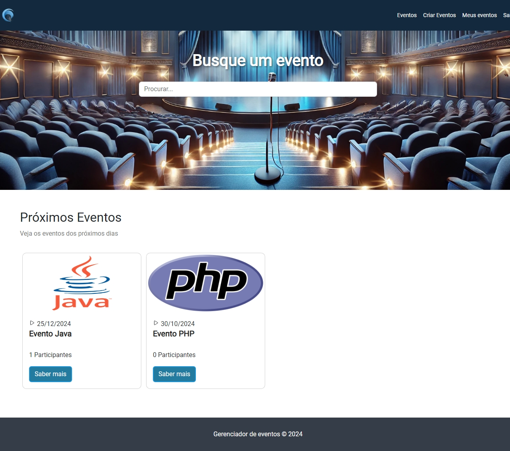

# Gerenciador de Eventos 🎉

Bem-vindo ao **Gerenciador de Eventos**, uma aplicação web desenvolvida em **Laravel** e **Bootstrap** que permite aos usuários criar, editar e gerenciar eventos de forma fácil e intuitiva. Este projeto foi criado para demonstrar habilidades em desenvolvimento web e design de interfaces.

## Demonstração 📸



## Recursos 🚀

- **Criação de Eventos**: Permite que os usuários criem novos eventos com informações detalhadas.
- **Edição de Eventos**: Os usuários podem editar informações de eventos existentes.
- **Upload de Imagens**: Os eventos podem ter imagens associadas, proporcionando uma melhor visualização.
- **Confirmação de Presença**: Os usuários podem confirmar sua presença nos eventos.
- **Pesquisa de Eventos**: Ferramenta de busca para facilitar a localização de eventos específicos.
- **Interface Responsiva**: A aplicação é otimizada para funcionar em dispositivos móveis e desktops.

## Tecnologias Utilizadas 💻

- [Laravel](https://laravel.com/) - Framework PHP para desenvolvimento de aplicações web.
- [Bootstrap](https://getbootstrap.com/) - Biblioteca de front-end para design responsivo e estilização.
- [XAMPP](https://www.apachefriends.org/index.html) - Pacote que inclui Apache, MySQL e PHP para desenvolvimento local.

## Pré-requisitos ⚙️

Antes de iniciar, verifique se você possui os seguintes itens instalados em seu ambiente:

- PHP 7.3 ou superior
- Composer
- MySQL
- Node.js e npm (opcional para compilação de ativos)

## Instalação 🛠️

### Clone o repositório:


```git clone https://github.com/victorhugoscf/event-management.git```

Navegue até o diretório do projeto
```cd event-management```

Instale as dependências do Composer
```composer install```

Configure o arquivo .env com suas credenciais do banco de dados
```DB_CONNECTION=mysql DB_HOST=127.0.0.1 DB_PORT=3306 DB_DATABASE=nome_do_banco DB_USERNAME=seu_usuario DB_PASSWORD=sua_senha```

Execute as migrações
```php artisan migrate```

Inicie o servidor de desenvolvimento:
```php artisan serve```

Acesse a aplicação em seu navegador: 🌐 ```http://localhost:8000 ```

## Contribuições 🤝
Contribuições são bem-vindas! Sinta-se à vontade para abrir uma issue ou enviar um pull request.

## Contato 📬
Se você tiver dúvidas ou sugestões, entre em contato:

## Victor - victorhugoscf@gmail.com
Agradeço por conferir o Gerenciador de Eventos! espero que você goste! 🎊

